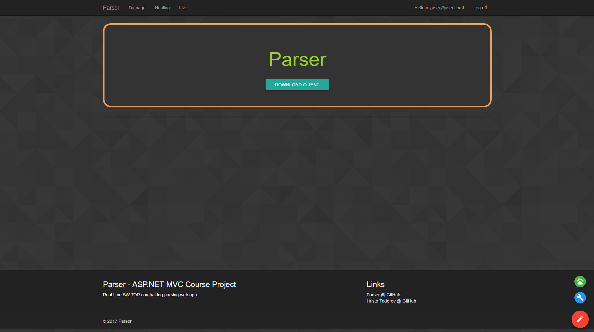
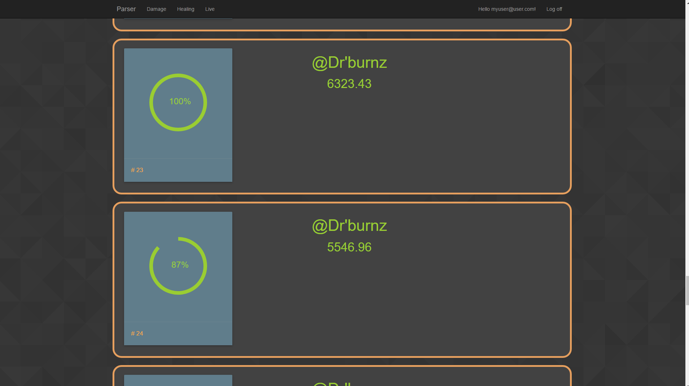
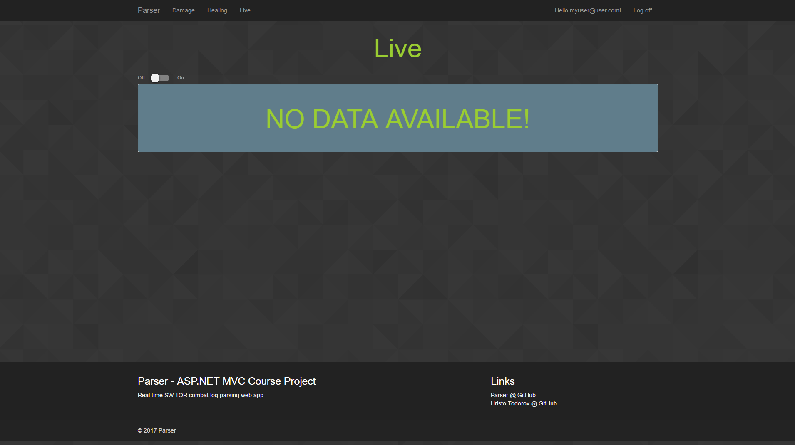
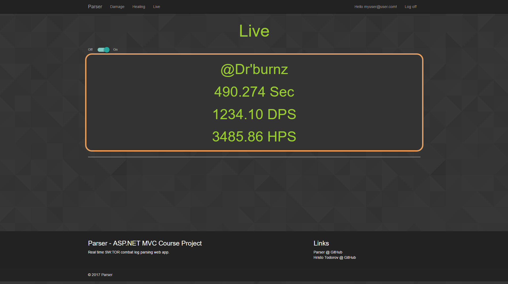

# [Parser @ Azure](http://parser-mvc.azurewebsites.net/) | [Live Demo](https://youtu.be/YeT6zSL0qIA)

---

## Features

- Live - Real time combat log information. User must be logged in with the same account in the web app and desktop app.
- Leaderboard - Publicly available list of all stored completed combat logs.

---

